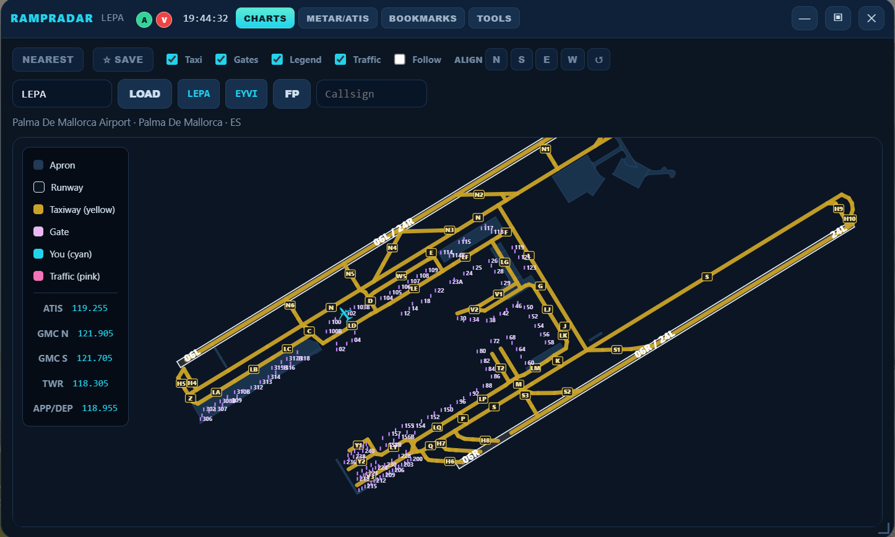

# [INSTALL](https://raw.githubusercontent.com/machpoint82/GeoFsRampRadar/main/rampradar.user.js)

# RampRadar

<p align="center">
  
</p>

<p align="center">
  <a href="https://www.geo-fs.com/"></a>
  <a href="https://www.tampermonkey.net/"></a>
  <a href="https://github.com/machpoint82/GeoFsRampRadar"></a>
  <a href="LICENSE"></a>
  <a href="https://github.com/machpoint82/GeoFsRampRadar/releases"></a>
</p>

**Live airport surface charts for [GeoFS](https://www.geo-fs.com/)** — taxiways, gates, runways, live multiplayer traffic, METAR, and digital ATIS. Lightweight standalone addon (no AeroDeck required).

---

## Features

- **Live charts** for 1000+ airports (SVG diagrams: runways, taxiways, gates, frequencies)
- **Own aircraft** (cyan) + **multiplayer traffic** (pink) with type-aware icons
- **Hover tooltips** — callsign, route, speed, altitude
- **Click traffic** to focus / follow
- **Nearest airport**, **bookmarks**, **ORIG / DEST** chips from flight plan
- **Optional callsign** shown on your own hover
- **METAR** (NOAA) + **digital ATIS** (DATIS where available; decoded METAR otherwise)
- **Minimize mode** — resizable / draggable mini chart while you fly
- **Optional keyboard shortcut** to open / restore / close

---

## Install

1. Install **[Tampermonkey](https://www.tampermonkey.net/)** (Chrome, Firefox, Edge, Safari, etc.)
2. Open the raw userscript:

   **[Install RampRadar](https://raw.githubusercontent.com/machpoint82/GeoFsRampRadar/main/rampradar.user.js)**

3. Tampermonkey will prompt to install — confirm.
4. Reload [GeoFS](https://www.geo-fs.com/geofs.php) and click **CHARTS** on the bottom toolbar.

> **Updates:** open the Tools tab inside RampRadar. When a new version is published, it shows the changelog and a link to the raw script so you can update in a new tab.

---

## Usage

| Control | Action |
|--------|--------|
| **CHARTS** (toolbar) | Open / close the panel |
| **AIRPORT ICAO** + LOAD | Open a diagram |
| **NEAREST** | Chart for the closest airport to your position |
| **ORIG / DEST** | Load origin or destination (from flight plan / FP button) |
| **☆ SAVE** | Bookmark current airport (manage under Bookmarks tab) |
| Layer toggles | Taxi / Gates / Legend / Traffic |
| **Follow** | Keep the chart centered on you (or focused traffic) |
| **—** minimize | Compact floating chart; drag & resize |
| METAR/ATIS tab | Origin & dest weather + manual lookup |

Missing a chart? [Open a GitHub Issue](https://github.com/machpoint82/GeoFsRampRadar/issues) and request the airport ICAO.

---

## Repository layout

```
GeoFsRampRadar/
├── rampradar.user.js    # Tampermonkey userscript
├── charts/              # Airport diagram JSON (ICAO.json)
├── preview/
│   ├── preview.png      # Screenshot for this README
│   └── icon.png         # Userscript icon
├── CHANGELOG.md         # Optional release notes
├── LICENSE
└── README.md
```

Charts are loaded from:

`https://cdn.jsdelivr.net/gh/machpoint82/GeoFsRampRadar@main/charts/{ICAO}.json`

---

## Compatibility

| Environment | Status |
|-------------|--------|
| GeoFS **3.9** | Supported |
| GeoFS **4.0** | Supported |
| Tampermonkey | Required |
| Violentmonkey / Greasemonkey | Should work (GM_* APIs) |

---

## Data sources

- **Charts** — this repository (`charts/`)
- **Airport names / positions** — [mwgg/airports](https://github.com/mwgg/airports)
- **METAR** — [NOAA Aviation Weather Center](https://aviationweather.gov/)
- **Digital ATIS** — [DATIS](https://datis.clowd.io/) (mainly US); elsewhere: decoded METAR (not official ATIS)

---

## License

[MIT](LICENSE) © machpoint82

---

## Credits

Chart rendering concepts inspired by community GeoFS tools and the AeroDeck EFB charts module. Aircraft silhouettes adapted for surface-map use. Not affiliated with GeoFS / GEFS.
